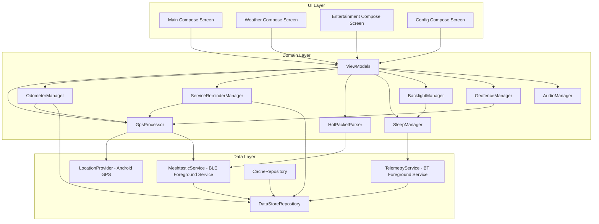

# Design Document: Android Golf Cart Computer

## Overview

This document describes the design for the Android Golf Cart Computer (GCD) application — a native Android app that replaces the existing ESP-32 based Golf Cart Display Computer. The app communicates with two external Bluetooth devices simultaneously: a Meshtastic radio (GCM) via BLE for mesh messaging and GPS, and a Golf Cart Internal computer (GCI) via Bluetooth Classic/BLE for vehicle telemetry.

The application is built with a three-layer architecture (UI, Domain, Data) using Jetpack Compose for the UI, Kotlin coroutines and flows for reactive state management, and Hilt for dependency injection. BLE communication uses the Kable library, and Meshtastic protobuf messages are generated using the Square Wire compiler.

### Key Design Decisions

1. **Java primary language with Kotlin interop** — The project uses Java as the primary language per requirements, but leverages Kotlin for BLE (Kable) and protobuf (Wire) since those libraries are Kotlin-native. Kotlin coroutines bridge naturally into Java via `ListenableFuture` or callback adapters.
2. **Foreground Services for Bluetooth** — Both Bluetooth connections run as Android foreground services to maintain connectivity when the app is backgrounded or the screen is off.
3. **StateFlow-based reactive architecture** — All state flows from the data layer through the domain layer to the UI via Kotlin `StateFlow`/`SharedFlow`, observed in Compose via `collectAsState()`.
4. **DataStore over SharedPreferences** — Jetpack DataStore (Preferences) provides type-safe, coroutine-based persistent storage with built-in debouncing support.

## Architecture



### Layer Responsibilities

| Layer | Responsibility | Key Technologies |
|-------|---------------|-----------------|
| **UI** | Render state, capture user input | Jetpack Compose, Material 3 |
| **Domain** | Business logic, data transformation, state coordination | Kotlin Coroutines, StateFlow |
| **Data** | External communication, persistence, platform APIs | Kable, Wire Protobuf, DataStore, Android Location |

### Dependency Injection

Hilt provides the DI container with the following module structure:

- `AppModule` — Singletons: DataStore, AudioManager, repositories
- `BluetoothModule` — BLE scanner, Kable peripheral factories
- `LocationModule` — FusedLocationProviderClient, LocationRequest
- `ServiceModule` — Service-scoped dependencies for foreground services

## Components and Interfaces

### 1. MeshtasticService (Foreground Service)

Manages the BLE connection to the Meshtastic radio using Kable.

```java
// Key interface exposed to domain layer
public interface MeshtasticConnection {
    StateFlow<ConnectionState> getConnectionState();
    StateFlow<String> getNodeId();
    SharedFlow<MeshPacket> getIncomingPackets();
    
    suspend void sendTextMessage(String text, long destination, int channel);
    suspend void sendAdminMessage(AdminMessage message);
    suspend void setPositionConfig(PositionConfig config);
    suspend void rebootRadio(int delaySeconds);
    suspend void disconnect();
    suspend void connect(String deviceAddress);
}
```

**BLE Protocol Implementation:**
- Service UUID: `6ba1b218-15a8-461f-9fa8-5dcae273eafd`
- TORADIO characteristic: `f75c76d2-129e-4dad-a1dd-7866124401e7` (write)
- FROMRADIO characteristic: `2c55e69e-4993-11ed-b878-0242ac120002` (read)
- FROMNUM characteristic: `ed9da18c-a800-4f66-a670-aa7547e34453` (notify)

**Packet Framing:**
- Outbound: 4-byte big-endian length prefix + protobuf-encoded `ToRadio` bytes
- MTU handling: Split packets exceeding (negotiated MTU - 3) bytes; default safe payload 20 bytes

**Connection Lifecycle:**
1. Scan for devices matching name pattern `^.*_([0-9a-fA-F]{4})$`
2. Connect and negotiate MTU
3. Subscribe to FROMNUM notifications
4. Send `ToRadio(want_config_id=<random>)` to initiate handshake
5. Process `FromRadio` responses: `my_info` (tag 3), `config` (tag 5), `config_complete_id` (tag 7)
6. Enter steady state: 30-second heartbeat, 60-second liveness timeout
7. On disconnect: send `ToRadio(disconnect=true)` before closing

### 2. TelemetryService (Foreground Service)

Manages the Bluetooth connection to the GCI ESP-32 computer.

```java
public interface TelemetryConnection {
    StateFlow<ConnectionState> getConnectionState();
    StateFlow<TelemetryData> getTelemetryData();
    
    suspend void sendHeartbeat();
    suspend void sendGpsData(GpsData gpsData);
    suspend void sendIsHome(boolean isHome);
    suspend void sendIsDaytime(boolean isDaytime);
    suspend void pairNewDevice(int timeoutSeconds);
}
```

**Message Protocol (mirrors ESP-NOW structure):**
```
| type (1 byte) | timestamp (4 bytes) | seq_num (2 bytes) | data_len (2 bytes) | data (variable) |
```

Message types: TEXT(0), GPS_DATA(1), TELEMETRY(2), COMMAND(3), ACK(4), HEARTBEAT(5), IS_HOME(6), IS_DAYTIME(7)

**Telemetry Data Packet (from GCI):**
- `modeLights` (int) — headlight mode
- `outdoorLum` (int) — outdoor luminosity
- `airTemp` (float) — air temperature
- `battVolts` (float) — battery voltage
- `fuel` (float) — fuel level

**Connection Management:**
- 10-second heartbeat interval
- 40-second timeout (4 missed heartbeats) marks GCI as disconnected
- 6-second pairing window with broadcast discovery + ACK handshake

### 3. GpsProcessor (Domain)

Processes raw GPS data from Android's FusedLocationProvider and/or Meshtastic position packets.

```java
public interface GpsProcessor {
    StateFlow<ProcessedGpsData> getGpsState();
    StateFlow<NavigationData> getNavigationData();
}
```

**Speed Filtering Algorithm:**
1. Filter speeds below 2.5 mph to zero (GPS dither elimination)
2. Reject speed spikes exceeding 8 mph/second acceleration
3. When speed < 4 mph and decreasing → report zero (responsive stop detection)
4. Require 2 consecutive readings above threshold before reporting movement (3 when dimmed)
5. If speed invalid but location valid and last speed < 5 mph → report zero

**Heading:** Convert bearing degrees to 16-point cardinal direction (N, NNE, NE, ENE, E, ESE, SE, SSE, S, SSW, SW, WSW, W, WNW, NW, NNW)

**Satellite/HDOP:**
- Require 3 consecutive zero-satellite readings before displaying zero
- Estimate HDOP when unavailable: ≥6 sats = 1.5, 4-5 sats = 2.0, <4 sats = 99.0

### 4. HotPacketParser (Domain)

Parses structured data packets received via Meshtastic text messages.

```java
public interface HotPacketParser {
    Result<WeatherData> parseWeatherPacket(String rawPacket);
    Result<List<VenueEvent>> parseVenueEventPacket(String rawPacket);
    boolean isHotPacket(String text);
    int parsePacketType(String text);
}
```

**Weather Packet Format:** `|#01#<current_temp>#<hr>,<glyph>,<temp>,<precip>#...#` (4 forecast hours)
- Validation: exactly 7 `#` delimiters and 12 `,` delimiters
- Temperature range: -99 to 999
- Hour labels: ≤6 characters
- Zero precipitation (`0.0`) cleared from display

**Venue/Event Packet Format:** `|#02#<venue>,<event>#<venue>,<event>#...#`
- Up to 12 venue/event pairs
- Header offset: 5 characters (`|#02#`)

### 5. OdometerManager (Domain)

Accumulates distance using GPS position calculations.

```java
public interface OdometerManager {
    StateFlow<OdometerState> getOdometerState();
    void resetTripOdometer();
}
```

**Distance Accumulation Rules:**
- Only accumulate when filtered speed > 0 (Doppler speed gating)
- Minimum position change: 2.6 feet (0.0005 miles) with Doppler confirmation
- Fallback minimum (no Doppler): 10 feet (0.002 miles)
- Reject position-based speed > 30 mph as GPS error
- Rollover at 100,000 miles
- Persist every 0.5 miles and before sleep/shutdown

### 6. SleepManager (Domain)

Implements the three-state power management system.

```java
public enum OperatingMode {
    STARTUP_GRACE,  // Waiting for GCI connection
    GCI_MODE,       // GCI connected, sleep controlled by GCI status
    STANDALONE_MODE // No GCI, backlight dimming only
}
```

**State Transitions:**
- STARTUP_GRACE → GCI_MODE: GCI connects during grace period
- STARTUP_GRACE → STANDALONE_MODE: Grace period expires without GCI
- GCI_MODE → STANDALONE_MODE: GCI disconnected for timeout period
- STANDALONE_MODE → GCI_MODE: GCI reconnects

**GPS Interval Management (Standalone Mode):**
- At home: 120 seconds (2 minutes)
- Away: 8 seconds

### 7. BacklightManager (Domain)

Controls display brightness based on time of day and activity.

```java
public interface BacklightManager {
    StateFlow<BrightnessState> getBrightnessState();
    void reportActivity();
}
```

- Day brightness between sunrise and sunset
- Night brightness between sunset and sunrise
- Inactivity timeout dims to off (0 disables auto-dim)
- Touch or movement restores brightness

### 8. GeofenceManager (Domain)

Calculates distance from home and manages at-home status.

```java
public interface GeofenceManager {
    StateFlow<GeofenceState> getGeofenceState();
    void setHomeLocation(double lat, double lon);
    void clearHomeLocation();
}
```

### 9. AudioManager (Domain)

Manages sound playback for system events.

```java
public interface AudioManager {
    void playStartupTone();
    void playMessageNotification();
    void playAlert();
    void playConfirmation();
    void playClick();
    void playError();
    void setVolume(int level); // 0-20
}
```

### 10. DataStoreRepository (Data)

Wraps Jetpack DataStore for type-safe persistent storage.

```java
public interface DataStoreRepository {
    // Preferences
    Flow<UserPreferences> getPreferences();
    suspend void updatePreference(PreferenceKey key, Object value);
    suspend void resetAllPreferences();
    
    // Cached data
    Flow<CachedWeatherData> getCachedWeather();
    Flow<CachedVenueData> getCachedVenueEvents();
    suspend void cacheWeatherData(String rawPacket, String timestamp, int dateYYYYMMDD);
    suspend void cacheVenueData(String rawPacket, String timestamp, int dateYYYYMMDD);
    
    // Odometer/Service
    suspend void persistOdometer(float accumDistance, float tripDistance);
    suspend void persistDrivingHours(int tenthsOfHours);
}
```

## Data Models

### Core Domain Models

```kotlin
// GPS State
data class ProcessedGpsData(
    val latitude: Double,
    val longitude: Double,
    val altitude: Double,
    val speedMph: Int,           // Filtered speed
    val rawSpeedMph: Float,     // Unfiltered for calculations
    val headingDegrees: Float,
    val cardinalDirection: String, // 16-point (N, NNE, etc.)
    val satelliteCount: Int,
    val hdop: Float,
    val timestamp: Long,        // UTC millis
    val isValid: Boolean
)

data class NavigationData(
    val dateString: String,     // "Mon, Jan 15"
    val timeString: String,     // "2:30 PM"
    val sunriseTime: String,    // "6:45 AM"
    val sunsetTime: String,     // "7:30 PM"
    val isDaytime: Boolean
)

// Weather
data class WeatherData(
    val currentTemp: Int,
    val forecasts: List<HourForecast>, // exactly 4
    val receivedTimestamp: String,
    val isStored: Boolean       // true if loaded from cache
)

data class HourForecast(
    val hourLabel: String,      // e.g., "10am"
    val glyphCode: Int,         // weather icon index
    val temperature: Int,
    val precipitation: String   // empty string if 0.0
)

// Entertainment
data class VenueEvent(
    val venueName: String,
    val eventName: String
)

data class EntertainmentData(
    val venues: List<VenueEvent>, // up to 12
    val receivedTimestamp: String,
    val isStored: Boolean
)

// Telemetry (from GCI)
data class TelemetryData(
    val headlightMode: Int,
    val outdoorLuminosity: Int,
    val airTemperature: Float,
    val batteryVoltage: Float,
    val fuelLevel: Float,
    val lastUpdated: Long
)

// Odometer
data class OdometerState(
    val totalMiles: Float,      // 1 decimal place, rolls at 100,000
    val tripMiles: Float,       // 1 decimal place, resettable
    val hoursSinceService: Float // tenths of hours
)

// Connection State
enum class ConnectionState {
    DISCONNECTED,
    SCANNING,
    CONNECTING,
    CONNECTED,
    HANDSHAKING,    // Meshtastic-specific: config download in progress
    READY           // Fully operational
}

// Geofence
data class GeofenceState(
    val homeLatitude: Double?,
    val homeLongitude: Double?,
    val isHomeSet: Boolean,
    val distanceFromHome: Float, // meters
    val isAtHome: Boolean,
    val fenceRadius: Int         // meters, default 500
)

// User Preferences
data class UserPreferences(
    val dayBrightness: Int,         // 0-10
    val nightBrightness: Int,       // 0-10
    val speakerVolume: Int,         // 0-20
    val flipScreen: Boolean,
    val backlightTimeoutMinutes: Int,
    val temperatureOffset: Float,
    val serviceIntervalHours: Int,  // default 100
    val gciMacAddress: String?,
    val homeLatitude: Double?,
    val homeLongitude: Double?,
    val homeFenceRadiusMeters: Int, // default 500
    val meshtasticEnabled: Boolean,
    val meshtasticDeviceAddress: String?
)
```

### Meshtastic Protocol Models (Wire-generated from .proto files)

Key protobuf messages used:

| Proto Message | Usage |
|--------------|-------|
| `ToRadio` | Wrapper for all outbound messages to radio |
| `FromRadio` | Wrapper for all inbound messages from radio |
| `MeshPacket` | Individual mesh network packet |
| `Data` | Decoded payload within MeshPacket |
| `AdminMessage` | Radio administration commands |
| `Config.PositionConfig` | GPS update interval configuration |
| `MyNodeInfo` | Local node identification (node number) |

**Port Numbers (from `portnums.proto`):**
- `TEXT_MESSAGE_APP` (1) — Text messages
- `POSITION_APP` (3) — Position data
- `ADMIN_APP` (6) — Admin commands
- `TELEMETRY_APP` (67) — Node telemetry

### GCI Communication Protocol Models

```kotlin
// Message envelope (mirrors ESP-NOW packet structure)
data class GciMessage(
    val type: GciMessageType,
    val timestamp: Long,        // Unix seconds
    val sequenceNumber: Int,
    val payload: ByteArray
)

enum class GciMessageType(val code: Int) {
    TEXT(0),
    GPS_DATA(1),
    TELEMETRY(2),
    COMMAND(3),
    ACK(4),
    HEARTBEAT(5),
    IS_HOME(6),
    IS_DAYTIME(7)
}

// Telemetry payload (from GCI → GCD)
data class GciTelemetryPayload(
    val modeLights: Int,
    val outdoorLum: Int,
    val airTemp: Float,
    val battVolts: Float,
    val fuel: Float
)

// Command payload (GCD → GCI)
data class GciCommandPayload(
    val cmdNumber: Int,         // GCI_CMD_ADD_PEER = 1
    val macAddress: ByteArray   // 6 bytes
)
```


## Correctness Properties

*A property is a characteristic or behavior that should hold true across all valid executions of a system — essentially, a formal statement about what the system should do. Properties serve as the bridge between human-readable specifications and machine-verifiable correctness guarantees.*

### Property 1: Protobuf serialization round-trip

*For any* valid `ToRadio` or `FromRadio` message, encoding to protobuf bytes and then decoding back should produce an equivalent message object.

**Validates: Requirements 1.5, 1.6, 18.8**

### Property 2: Packet framing round-trip

*For any* protobuf-encoded byte array, framing with a 4-byte big-endian length prefix and then unframing (reading the length, extracting the payload) should produce the original byte array.

**Validates: Requirements 18.2**

### Property 3: Message routing acceptance

*For any* incoming `MeshPacket`, the message should be accepted if and only if the destination is the broadcast address (`0xFFFFFFFF`) or matches the local node number.

**Validates: Requirements 2.2**

### Property 4: Outbound message construction

*For any* valid text string, destination node number, and channel index, the constructed `MeshPacket` should have: the correct destination, the specified channel, port number `TEXT_MESSAGE_APP`, a non-zero random packet ID, and the text encoded as payload bytes.

**Validates: Requirements 2.3, 2.4, 2.9, 18.7**

### Property 5: Outbound payload size limit

*For any* text string, the encoded payload written to the TORADIO characteristic should never exceed 237 bytes. Strings that would exceed this limit should be rejected or truncated before encoding.

**Validates: Requirements 2.7**

### Property 6: Weather packet structural validation

*For any* string input to the weather parser, the packet should be accepted if and only if it starts with `|#01#`, contains exactly 7 `#` delimiters and exactly 12 `,` delimiters, all temperature fields are within -99 to 999, and all hour labels are 6 characters or fewer.

**Validates: Requirements 3.2, 3.9, 3.10, 3.12**

### Property 7: Weather packet parsing correctness

*For any* structurally valid weather packet (passing validation in Property 6), parsing should produce a `WeatherData` object with a valid current temperature and exactly 4 `HourForecast` entries, each containing a non-empty hour label, a glyph code, a temperature, and a precipitation string.

**Validates: Requirements 3.1, 3.3**

### Property 8: Precipitation zero-clearing

*For any* precipitation value string in a weather packet, if the value equals `"0.0"` then the parsed precipitation field should be an empty string; otherwise the original value should be preserved.

**Validates: Requirements 3.11**

### Property 9: Venue/event packet parsing

*For any* valid venue/event packet (starting with `|#02#` and containing 1-12 `#`-delimited venue,event pairs), parsing should produce a list of `VenueEvent` objects where each entry's venue name and event name match the corresponding comma-separated pair in the input, and the list length equals the number of pairs in the packet (up to 12).

**Validates: Requirements 4.1, 4.2, 4.4**

### Property 10: Cache date validation

*For any* cached data entry with a stored date (YYYYMMDD format) and any current date, the cache should be restored if and only if the stored date equals the current date. If the stored date differs from the current date, the cache should be treated as stale.

**Validates: Requirements 3.7, 3.8, 4.7, 19.3, 19.4, 19.5**

### Property 11: GPS speed filtering

*For any* sequence of raw GPS speed readings, the filtered output should satisfy all of: (a) any raw speed below 2.5 mph maps to zero, (b) any speed spike exceeding 8 mph/s acceleration from the previous reading is rejected, (c) when filtered speed is below 4 mph and decreasing, output is zero, and (d) movement is only reported after 2 consecutive readings above the motion threshold.

**Validates: Requirements 5.4, 5.5, 5.6, 5.7**

### Property 12: Cardinal direction mapping

*For any* bearing value in degrees [0, 360), the 16-point cardinal direction mapping should produce the correct direction label, and the mapping should be consistent (same input always produces same output). Adjacent direction boundaries should be at 22.5-degree intervals centered on each cardinal point.

**Validates: Requirements 5.8**

### Property 13: Satellite count debounce

*For any* sequence of satellite count readings, a zero satellite count should only be displayed after 3 or more consecutive zero readings. Any non-zero reading should reset the consecutive-zero counter and display immediately.

**Validates: Requirements 5.11**

### Property 14: HDOP estimation from satellite count

*For any* satellite count value, when direct HDOP data is unavailable, the estimated HDOP should be: 1.5 for counts ≥ 6, 2.0 for counts 4-5, and 99.0 for counts < 4.

**Validates: Requirements 5.12**

### Property 15: Distance accumulation gating

*For any* GPS position update, distance should only be accumulated when: (a) filtered speed is greater than zero, (b) the position change exceeds 2.6 feet (0.0005 miles) when Doppler speed is available, (c) the position change exceeds 10 feet (0.002 miles) when Doppler speed is unavailable, and (d) the implied speed from position change does not exceed 30 mph.

**Validates: Requirements 6.4, 6.5, 6.6, 6.7**

### Property 16: Odometer invariants

*For any* sequence of distance accumulations and trip resets: (a) resetting the trip odometer should set trip distance to zero without affecting total distance, (b) total distance should equal the sum of all accumulated segments regardless of trip resets, and (c) total distance should roll over to zero at exactly 100,000 miles.

**Validates: Requirements 6.1, 6.2, 6.8**

### Property 17: Driving hours accumulation gating

*For any* time delta and vehicle speed state, driving hours should only accumulate when speed is greater than zero AND the time delta is between 0 and 10 seconds (inclusive). Time deltas outside this range should be discarded.

**Validates: Requirements 7.1, 7.5**

### Property 18: Geofence status determination

*For any* current GPS position and home location with a configured radius, the `at_home` status should be `true` if and only if the calculated distance between the current position and home location is less than or equal to the configured geofence radius.

**Validates: Requirements 9.4, 9.5, 9.6**

### Property 19: Brightness level selection

*For any* current time, sunrise time, and sunset time, the selected brightness level should be the day brightness value when the current time is between sunrise and sunset (inclusive), and the night brightness value otherwise.

**Validates: Requirements 10.1, 10.2**

### Property 20: Sleep state machine transitions

*For any* sequence of events (GCI connect, GCI disconnect, timeout expiry, grace period expiry), the sleep operating mode should transition correctly: STARTUP_GRACE → GCI_MODE only when GCI connects, STARTUP_GRACE → STANDALONE_MODE only when grace period expires without GCI, GCI_MODE → STANDALONE_MODE only when GCI disconnected for timeout period, and STANDALONE_MODE → GCI_MODE only when GCI reconnects.

**Validates: Requirements 11.1, 11.2, 11.3, 11.4, 11.5**

## Error Handling

### Bluetooth Errors

| Error Condition | Handling Strategy |
|----------------|-------------------|
| BLE connection lost | Automatic reconnection with exponential backoff (1s, 2s, 4s, 8s, max 30s) |
| BLE write failure | Retry up to 3 times, then report error to UI |
| MTU negotiation failure | Fall back to 20-byte safe payload size |
| GCI connection lost | Mark as disconnected after 40s timeout, attempt reconnection |
| Pairing timeout | Restore previous device address, notify user |
| Permission denied | Show rationale dialog, guide user to settings |

### GPS Errors

| Error Condition | Handling Strategy |
|----------------|-------------------|
| No GPS fix | Display "NO GPS" after 60 seconds without time update |
| Speed spike (>8 mph/s) | Discard reading, retain previous filtered value |
| Position-based speed >30 mph | Discard distance calculation for that segment |
| Zero satellites (brief) | Debounce: require 3 consecutive zeros before displaying |
| Invalid speed with valid location | Report zero if last speed < 5 mph, else retain last speed |

### Data Parsing Errors

| Error Condition | Handling Strategy |
|----------------|-------------------|
| Malformed HoT packet | Discard packet, log diagnostic with first 40 chars |
| Wrong delimiter count | Reject entire packet, do not partially parse |
| Temperature out of range | Clamp to -99..999 range |
| Hour label too long | Truncate to 6 characters |
| Venue/event packet too short | Discard, log warning |
| Cache from previous day | Treat as stale, request fresh data |

### System Errors

| Error Condition | Handling Strategy |
|----------------|-------------------|
| DataStore write failure | Retry with exponential backoff, log error |
| Service killed by OS | Foreground service with notification ensures restart |
| Out of memory | Limit message history, clear old cache entries |
| Audio playback failure | Silently fail, log warning |

## Testing Strategy

### Property-Based Testing

**Library:** [jqwik](https://jqwik.net/) — the leading property-based testing framework for the JVM (Java/Kotlin).

**Configuration:**
- Minimum 100 iterations per property test
- Each test tagged with: `Feature: android-golf-cart-computer, Property {N}: {title}`
- Generators for domain types: GPS coordinates, speed sequences, weather packets, venue packets, protobuf messages

**Property tests cover:**
- Protobuf serialization round-trips (Properties 1, 2)
- Message routing and construction (Properties 3, 4, 5)
- Packet parsing and validation (Properties 6, 7, 8, 9)
- Cache date logic (Property 10)
- GPS speed filtering pipeline (Property 11)
- Navigation calculations (Properties 12, 13, 14)
- Distance/odometer logic (Properties 15, 16)
- Time accumulation (Property 17)
- Geofencing (Property 18)
- Brightness selection (Property 19)
- State machine transitions (Property 20)

### Unit Testing (Example-Based)

Unit tests complement property tests for specific scenarios:

- **Meshtastic handshake sequence** — Verify correct order of operations during BLE connection setup
- **Heartbeat timing** — Verify 30-second interval and 60-second timeout detection
- **AWAKE notification** — Verify `~#01#GC#AWAKE#` sent on connection
- **Weather/venue request** — Verify `~#01#GC#REQ_WX_ENT#` sent when cache is stale
- **Audio event triggers** — Verify correct tone played for each event type
- **Date/time formatting** — Verify "Mon, Jan 15" and "2:30 PM" formats
- **Sunrise/sunset display** — Verify 12-hour format output
- **Admin command construction** — Verify reboot and config commands
- **Preference debounce** — Verify 2-second write debounce for slider values
- **New data indicator** — Verify 5-second auto-clear timer

### Integration Testing

- **BLE connection lifecycle** — End-to-end with mock BLE peripheral
- **Dual Bluetooth independence** — Verify one connection failure doesn't affect the other
- **DataStore persistence** — Verify round-trip storage and retrieval
- **Foreground service lifecycle** — Verify service survives app backgrounding
- **Permission flow** — Verify graceful handling of denied permissions

### Test Infrastructure

```
app/src/test/          — Unit tests and property tests (jqwik + JUnit 5)
app/src/androidTest/   — Instrumented tests (Compose UI tests, integration tests)
```

**Key test dependencies:**
- `jqwik` — Property-based testing
- `mockk` — Kotlin mocking (for Kable, Wire classes)
- `turbine` — Flow testing
- `robolectric` — Android framework mocking for unit tests
- `compose-ui-test` — Compose UI testing
