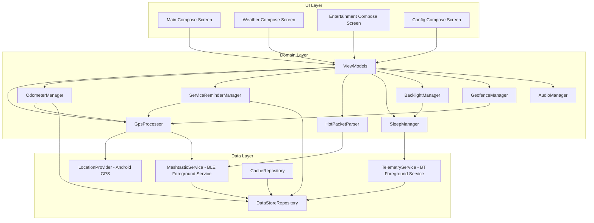

# Design Documentation

This document provides the complete technical design for the Android Golf Cart Computer, including component interfaces, communication protocols, data models, and correctness properties.

## System Architecture



## Key Design Decisions

| Decision | Rationale |
|----------|-----------|
| Java primary, Kotlin interop | Requirements specify Java; Kable and Wire are Kotlin-native |
| Foreground Services for BLE | Maintains connectivity when backgrounded or screen off |
| StateFlow reactive architecture | Unidirectional data flow, lifecycle-aware, Compose-friendly |
| DataStore over SharedPreferences | Type-safe, coroutine-based, built-in debouncing |
| jqwik for property testing | Leading JVM property-based testing framework |
| Hilt for DI | Official Android DI solution, integrates with ViewModel and Services |

## Component Interfaces

### MeshtasticConnection

```java
public interface MeshtasticConnection {
    StateFlow<ConnectionState> getConnectionState();
    StateFlow<String> getNodeId();
    SharedFlow<MeshPacket> getIncomingPackets();
    
    suspend void sendTextMessage(String text, long destination, int channel);
    suspend void sendAdminMessage(AdminMessage message);
    suspend void setPositionConfig(PositionConfig config);
    suspend void rebootRadio(int delaySeconds);
    suspend void disconnect();
    suspend void connect(String deviceAddress);
}
```

### TelemetryConnection

```java
public interface TelemetryConnection {
    StateFlow<ConnectionState> getConnectionState();
    StateFlow<TelemetryData> getTelemetryData();
    
    suspend void sendHeartbeat();
    suspend void sendGpsData(GpsData gpsData);
    suspend void sendIsHome(boolean isHome);
    suspend void sendIsDaytime(boolean isDaytime);
    suspend void pairNewDevice(int timeoutSeconds);
}
```

### GpsProcessor

```java
public interface GpsProcessor {
    StateFlow<ProcessedGpsData> getGpsState();
    StateFlow<NavigationData> getNavigationData();
}
```

### HotPacketParser

```java
public interface HotPacketParser {
    Result<WeatherData> parseWeatherPacket(String rawPacket);
    Result<List<VenueEvent>> parseVenueEventPacket(String rawPacket);
    boolean isHotPacket(String text);
    int parsePacketType(String text);
}
```

### OdometerManager

```java
public interface OdometerManager {
    StateFlow<OdometerState> getOdometerState();
    void resetTripOdometer();
}
```

### BacklightManager

```java
public interface BacklightManager {
    StateFlow<BrightnessState> getBrightnessState();
    void reportActivity();
}
```

### GeofenceManager

```java
public interface GeofenceManager {
    StateFlow<GeofenceState> getGeofenceState();
    void setHomeLocation(double lat, double lon);
    void clearHomeLocation();
}
```

### AudioManager

```java
public interface AudioManager {
    void playStartupTone();
    void playMessageNotification();
    void playAlert();
    void playConfirmation();
    void playClick();
    void playError();
    void setVolume(int level); // 0-20
}
```

### DataStoreRepository

```java
public interface DataStoreRepository {
    Flow<UserPreferences> getPreferences();
    suspend void updatePreference(PreferenceKey key, Object value);
    suspend void resetAllPreferences();
    
    Flow<CachedWeatherData> getCachedWeather();
    Flow<CachedVenueData> getCachedVenueEvents();
    suspend void cacheWeatherData(String rawPacket, String timestamp, int dateYYYYMMDD);
    suspend void cacheVenueData(String rawPacket, String timestamp, int dateYYYYMMDD);
    
    suspend void persistOdometer(float accumDistance, float tripDistance);
    suspend void persistDrivingHours(int tenthsOfHours);
}
```

## Communication Protocols

### Meshtastic BLE Protocol

#### GATT Characteristics

| Characteristic | UUID | Direction | Purpose |
|---------------|------|-----------|---------|
| Service | `6ba1b218-15a8-461f-9fa8-5dcae273eafd` | — | Service identifier |
| TORADIO | `f75c76d2-129e-4dad-a1dd-7866124401e7` | Write | Send packets to radio |
| FROMRADIO | `2c55e69e-4993-11ed-b878-0242ac120002` | Read | Receive packets from radio |
| FROMNUM | `ed9da18c-a800-4f66-a670-aa7547e34453` | Notify | New data available signal |

#### Packet Framing

Outbound packets use a 4-byte big-endian length prefix:

```
┌──────────────────┬─────────────────────────────────┐
│ Length (4 bytes)  │ Protobuf ToRadio payload        │
│ Big-endian uint32│ (variable length)               │
└──────────────────┴─────────────────────────────────┘
```

If the total write exceeds (MTU - 3) bytes, the payload is split into chunks. Default safe payload without MTU negotiation: 20 bytes.

#### Connection Handshake

```
GCD                                    Meshtastic Radio
 │                                           │
 │──── Subscribe to FROMNUM ────────────────►│
 │                                           │
 │──── ToRadio(want_config_id=<random>) ───►│
 │                                           │
 │◄─── FromRadio(my_info) ──────────────────│  (tag 3: node number)
 │                                           │
 │◄─── FromRadio(config) ──────────────────│  (tag 5: position config)
 │                                           │
 │◄─── FromRadio(config_complete_id) ──────│  (tag 7: handshake done)
 │                                           │
 │         ═══ Steady State ═══              │
 │                                           │
 │──── Heartbeat (every 30s) ──────────────►│
 │                                           │
 │◄─── FROMNUM notification ───────────────│
 │──── Read FROMRADIO (poll until empty) ──►│
 │                                           │
```

#### Port Numbers

| Port | Name | Usage |
|------|------|-------|
| 1 | TEXT_MESSAGE_APP | Text messages (including HoT packets) |
| 3 | POSITION_APP | GPS position data |
| 6 | ADMIN_APP | Radio administration commands |
| 67 | TELEMETRY_APP | Node telemetry data |

#### Message Construction

Outbound text messages are wrapped as:
```
ToRadio {
  packet: MeshPacket {
    to: destination_node_number (0xFFFFFFFF for broadcast)
    channel: channel_index
    decoded: Data {
      portnum: TEXT_MESSAGE_APP
      payload: UTF-8 encoded text bytes
    }
    id: random_non_zero_uint32
  }
}
```

Maximum payload: 237 bytes.

### GCI Telemetry Protocol

#### Message Envelope

```
┌──────────┬────────────┬──────────┬──────────┬─────────────┐
│ Type     │ Timestamp  │ Seq Num  │ Data Len │ Data        │
│ (1 byte) │ (4 bytes)  │ (2 bytes)│ (2 bytes)│ (variable)  │
└──────────┴────────────┴──────────┴──────────┴─────────────┘
```

#### Message Types

| Code | Type | Direction | Description |
|------|------|-----------|-------------|
| 0 | TEXT | Both | Text messages |
| 1 | GPS_DATA | GCD → GCI | GPS position data |
| 2 | TELEMETRY | GCI → GCD | Vehicle telemetry |
| 3 | COMMAND | GCD → GCI | Commands (pairing) |
| 4 | ACK | GCI → GCD | Acknowledgment |
| 5 | HEARTBEAT | Both | Connection keepalive |
| 6 | IS_HOME | GCD → GCI | At-home status |
| 7 | IS_DAYTIME | GCD → GCI | Daytime status |

#### Telemetry Payload (GCI → GCD)

| Field | Type | Description |
|-------|------|-------------|
| modeLights | int | Headlight mode |
| outdoorLum | int | Outdoor luminosity |
| airTemp | float | Air temperature (°F) |
| battVolts | float | Battery voltage |
| fuel | float | Fuel level |

#### Connection Timing

- Heartbeat interval: 10 seconds
- Disconnect timeout: 40 seconds (4 missed heartbeats)
- Pairing window: 6 seconds

### HoT Packet Protocol

"Hands-off-Transmission" packets are structured data delivered via Meshtastic text messages.

#### Identification
- All HoT packets start with `|` character
- Type code follows `|#` prefix: `01` = weather, `02` = venue/event

#### Weather Packet (`|#01#`)

```
|#01#<current_temp>#<hr>,<glyph>,<temp>,<precip>#<hr>,<glyph>,<temp>,<precip>#<hr>,<glyph>,<temp>,<precip>#<hr>,<glyph>,<temp>,<precip>#
```

Validation rules:
- Exactly 7 `#` delimiters
- Exactly 12 `,` delimiters
- Temperature range: -99 to 999
- Hour labels: ≤ 6 characters
- Precipitation `0.0` → empty string

#### Venue/Event Packet (`|#02#`)

```
|#02#<venue>,<event>#<venue>,<event>#...#
```

- Up to 12 venue/event pairs
- Venue and event separated by `,`
- Pairs separated by `#`

## Data Models

### Core Domain Models

```kotlin
data class ProcessedGpsData(
    val latitude: Double,
    val longitude: Double,
    val altitude: Double,
    val speedMph: Int,
    val rawSpeedMph: Float,
    val headingDegrees: Float,
    val cardinalDirection: String,
    val satelliteCount: Int,
    val hdop: Float,
    val timestamp: Long,
    val isValid: Boolean
)

data class NavigationData(
    val dateString: String,     // "Mon, Jan 15"
    val timeString: String,     // "2:30 PM"
    val sunriseTime: String,    // "6:45 AM"
    val sunsetTime: String,     // "7:30 PM"
    val isDaytime: Boolean
)

data class WeatherData(
    val currentTemp: Int,
    val forecasts: List<HourForecast>,
    val receivedTimestamp: String,
    val isStored: Boolean
)

data class HourForecast(
    val hourLabel: String,
    val glyphCode: Int,
    val temperature: Int,
    val precipitation: String
)

data class VenueEvent(
    val venueName: String,
    val eventName: String
)

data class TelemetryData(
    val headlightMode: Int,
    val outdoorLuminosity: Int,
    val airTemperature: Float,
    val batteryVoltage: Float,
    val fuelLevel: Float,
    val lastUpdated: Long
)

data class OdometerState(
    val totalMiles: Float,
    val tripMiles: Float,
    val hoursSinceService: Float
)

enum class ConnectionState {
    DISCONNECTED, SCANNING, CONNECTING,
    CONNECTED, HANDSHAKING, READY
}

data class GeofenceState(
    val homeLatitude: Double?,
    val homeLongitude: Double?,
    val isHomeSet: Boolean,
    val distanceFromHome: Float,
    val isAtHome: Boolean,
    val fenceRadius: Int
)

data class UserPreferences(
    val dayBrightness: Int,
    val nightBrightness: Int,
    val speakerVolume: Int,
    val flipScreen: Boolean,
    val backlightTimeoutMinutes: Int,
    val temperatureOffset: Float,
    val serviceIntervalHours: Int,
    val gciMacAddress: String?,
    val homeLatitude: Double?,
    val homeLongitude: Double?,
    val homeFenceRadiusMeters: Int,
    val meshtasticEnabled: Boolean,
    val meshtasticDeviceAddress: String?
)
```

### Sleep State Machine

```
                    ┌─────────────────┐
                    │  STARTUP_GRACE  │
                    │  (wait for GCI) │
                    └────────┬────────┘
                             │
              ┌──────────────┼──────────────┐
              │ GCI connects │              │ Grace expires
              ▼              │              ▼
    ┌─────────────────┐      │    ┌─────────────────────┐
    │    GCI_MODE     │      │    │  STANDALONE_MODE    │
    │ (GCI controls   │◄─────┘    │  (dimming only,     │
    │  sleep)         │           │   never deep sleep) │
    └────────┬────────┘           └──────────▲──────────┘
             │                               │
             │ GCI disconnected              │ GCI reconnects
             │ for timeout period            │
             └───────────────────────────────┘
```

## Correctness Properties

The system defines 20 formal correctness properties validated through property-based testing:

| # | Property | Validates |
|---|----------|-----------|
| 1 | Protobuf serialization round-trip | Req 1.5, 1.6, 18.8 |
| 2 | Packet framing round-trip | Req 18.2 |
| 3 | Message routing acceptance | Req 2.2 |
| 4 | Outbound message construction | Req 2.3, 2.4, 2.9, 18.7 |
| 5 | Outbound payload size limit (237 bytes) | Req 2.7 |
| 6 | Weather packet structural validation | Req 3.2, 3.9, 3.10, 3.12 |
| 7 | Weather packet parsing correctness | Req 3.1, 3.3 |
| 8 | Precipitation zero-clearing | Req 3.11 |
| 9 | Venue/event packet parsing | Req 4.1, 4.2, 4.4 |
| 10 | Cache date validation | Req 3.7, 3.8, 4.7, 19.3-19.5 |
| 11 | GPS speed filtering | Req 5.4, 5.5, 5.6, 5.7 |
| 12 | Cardinal direction mapping | Req 5.8 |
| 13 | Satellite count debounce | Req 5.11 |
| 14 | HDOP estimation from satellite count | Req 5.12 |
| 15 | Distance accumulation gating | Req 6.4, 6.5, 6.6, 6.7 |
| 16 | Odometer invariants | Req 6.1, 6.2, 6.8 |
| 17 | Driving hours accumulation gating | Req 7.1, 7.5 |
| 18 | Geofence status determination | Req 9.4, 9.5, 9.6 |
| 19 | Brightness level selection | Req 10.1, 10.2 |
| 20 | Sleep state machine transitions | Req 11.1-11.5 |

Each property is tested with minimum 100 random iterations using jqwik generators for domain types.

## Error Handling

### Bluetooth Errors

| Condition | Strategy |
|-----------|----------|
| BLE connection lost | Exponential backoff reconnection (1s → 30s max) |
| BLE write failure | Retry 3x, then report to UI |
| MTU negotiation failure | Fall back to 20-byte payload |
| GCI connection lost | Mark disconnected after 40s, auto-reconnect |
| Pairing timeout | Restore previous address, notify user |
| Permission denied | Rationale dialog → settings |

### GPS Errors

| Condition | Strategy |
|-----------|----------|
| No GPS fix | Display "NO GPS" after 60s |
| Speed spike (>8 mph/s) | Discard, retain previous |
| Position speed >30 mph | Discard distance segment |
| Zero satellites (brief) | Debounce: 3 consecutive zeros |
| Invalid speed, valid location | Zero if last < 5 mph, else retain |

### Data Parsing Errors

| Condition | Strategy |
|-----------|----------|
| Malformed HoT packet | Discard, log first 40 chars |
| Wrong delimiter count | Reject entire packet |
| Temperature out of range | Clamp to -99..999 |
| Hour label too long | Truncate to 6 chars |
| Cache from previous day | Treat as stale, request fresh |
